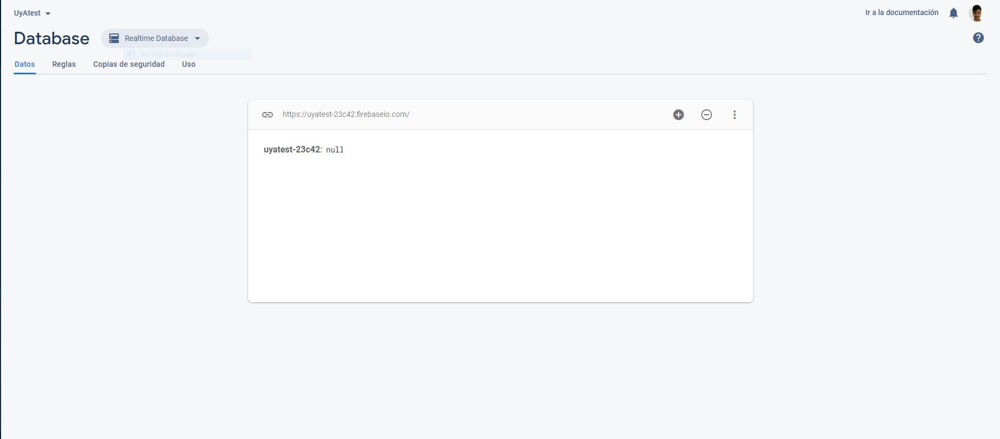
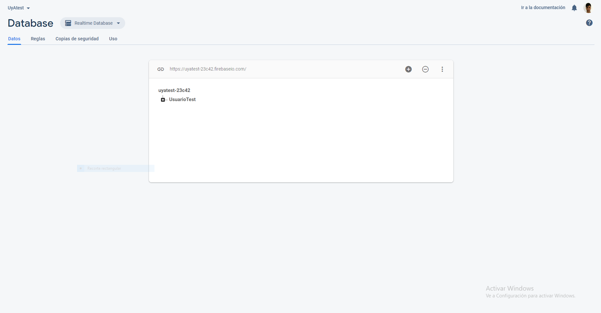
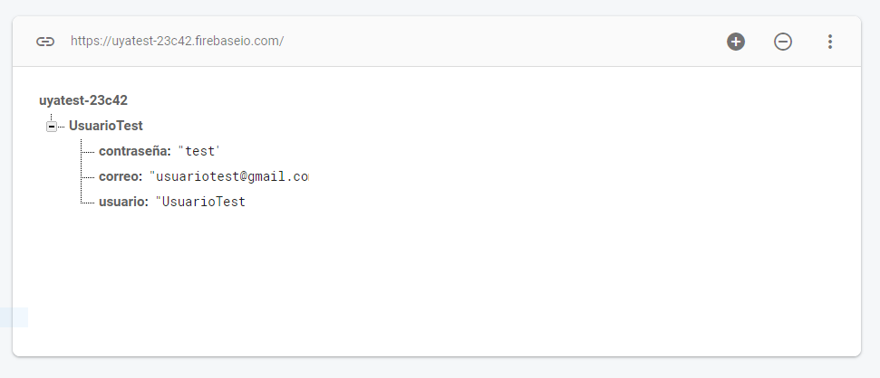

# Usabilidad y Accesibilidad
## Práctica 7: Introducción a Firebase I - Informe
Realizado por:
**GRUPO 04**
- Aitor Alonso Melian
- Jesus Chamizo Pérez
- Eduardo Da Silva Yanes

### 
Lo que se pretende en esta práctica es añadir información a una base de datos de Firebase desde nuestra página web. Para ello haremos uso de código en JavaScript así como las propias herramientas de Firebase.

#### Base de datos Firebase:Antes de añadir usuarios
Esta es nuestra base de datos antes de tener ningún usuario. Como podemos apreciar, está vacía.


#### Añadir usuarios
Para añadir usuarios lo unico que debemos hacer es rellenar el cuestionario de nuestra página. Si todo está correcto, se mostrará un mensaje indicanto que el registro se ha efectuado satisfactoriamente.


Para hacer esto posible, hemos utilizado los siguientes fragmento de código:
```javascript
//Fichero JS autentificación
//Grupo 04 UyA - Aitor Alonso, Jesús Chamizo, Eduardo Da Silva
const signupForm = document.querySelector('#formulario');
signupForm.addEventListener('submit', (e) => {
	e.preventDefault();
	//Obtenermos los valores del formulario
	const name = signupForm['first_name'].value;
	const email = signupForm['signup_email'].value;
	const password = signupForm['signup_password'].value;
	const password2 = signupForm['signup_sec_password'].value;
	const terms = signupForm['checkterms'].value;

    	if((password==password2)&&(terms)){
          	//var referencia = database.ref(name);
		var referencia = database.ref(name);
      		//Add users data
		referencia.set({
            		usuario: name,
            		correo: email,
           		contraseña: password
        	});
      		window.alert("Registrado correctamente");
      		signupForm.reset();
   	} else {
        if(password!=password2){
            window.alert("Las contraseñas no coinciden");
        }else{
            window.alert("Acepte los terminos de nuestra web.");
        }
    }
});
```
Lo que hacemos en este fragmento es crear hijos a la rama principal. La información de cada hijo la obtenemos de los campos del formulario mediante los `signupForm['xxxxx'].value`.

#### Base de datos Firebase: Después de añadir un usuario
Después de darle a "Enviar", se crea una nueva entrada en la base de datos.


Como podemos observar, los datos se muestran correctamente. A nivel práctico, tener la contraseña almacenada de esa manera es algo muy peligroso y se debería tratar por otros métodos pero, en este caso, nos sirve solo como ejemplo práctico.
